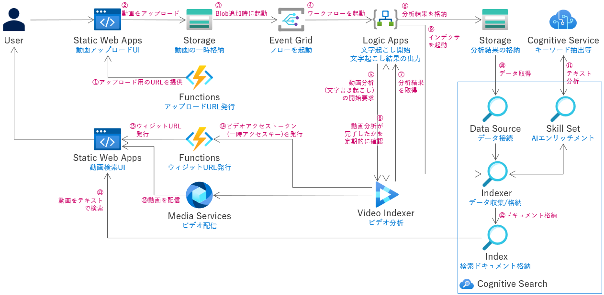

# Azure での文字列でのビデオファイルの検索
- このソリューションを使うことで、動画データを分析し、動画内で話された内容をテキストとして書き起こし、その内容を全文検索エンジンでテキストベースで検索可能とすることができます
- Azure Video Indexer を使用することで、動画ファイルの文字起こしを行います
- 文字起こしの結果を Azure Cognitive Search へ登録することで、指定した文字列でどの動画ファイルのどの時点で話した内容かを検索することができます
- 例えば、Microsoft Teams で会議は録画されているが、録画動画が大量にあるため、特定トピックについて話した会議の動画を探すのが困難、といったケースで本ソリューションで動画を跨いだテキスト検索を実現可能にします

## 必要な環境
- [Azure CLI](https://docs.microsoft.com/ja-jp/cli/azure/install-azure-cli)
- [Azure Bicep](https://docs.microsoft.com/ja-jp/azure/azure-resource-manager/bicep/install)
- [.NET 6.0](https://dotnet.microsoft.com/ja-jp/download/dotnet/6.0)
- [Azure Functions Core Tools ](https://learn.microsoft.com/ja-jp/azure/azure-functions/functions-run-local)
- [Azure Static Web Apps CLI](https://github.com/Azure/static-web-apps-cli)
- [npm](https://www.npmjs.com/)
- bash が実行できるコンソール (Windows だと [Git Bash](https://gitforwindows.org/) など)

## デプロイ方法

必要な環境を用意し、設定(Azure CLI での Azure テナントへログインなど)を行った後に、以下の様に、第一引数にリソースグループ名を指定して ```deploy.sh``` スクリプトを実行します。
```bash
./deploy.sh [リソースグループ名]
# 例： ./deploy.sh rg-video-search
```

## 展開される Azure アーキテクチャ



## 使用する Azure サービス
- Azure Functions
- Azure Logic Apps
- Azure Static Web Apps
- Azure Cognitive Search
- Azure Cognitive Service
- Azure Video Indexer
- Azure Media Services
- Azure Event Grid
- Azure Storage
- Azure Application Insights
- Azure Active Directory
